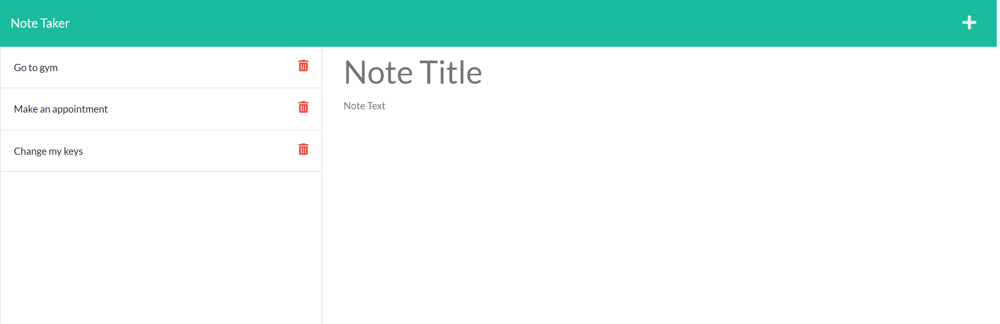

# Note taker
  
  ## Table of Contents:
  1. [Description](#Description) 
  2. [Deployed](#Deployed)
  3. [Usage](#Usage)  
  4. [Contributing](#Contributing)
  5. [Screenshot](#Screenshot)
  6. [License](#License)
  7. [Questions](#Questions)
  
## Description
An application to write and save note with Express.js back end and will save and retrieve note data from JSON file. 
## Deployed
https://sasan-note-taker.herokuapp.com/

## Usage
Application will allow user to be able to add note's title and description.
Application will allow user to be able to save the notes and won't lose them even they refresh 
the page.
Application will allow user to delete notes
## Contributing
pull request
## Screenshot

## License
[MIT License](https://opensource.org/licenses/MIT)
## Questions
You can contact me at my Email: sasan_2002@yahoo.com

Link to my Github profile: [sasansinson](https://github.com/sasansinson)